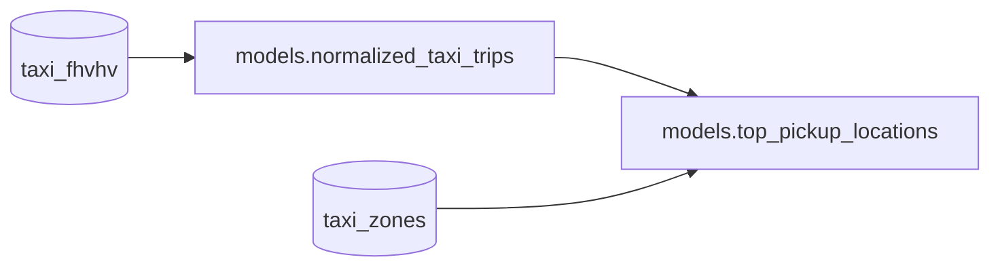

# Data visualization app with Streamlit

In this example, we will use the [TLC NY Taxi dataset](https://www.nyc.gov/site/tlc/about/tlc-trip-record-data.page) and build a pipeline that produces a table showcasing the boroughs and zones in New York City with the highest number of taxi pickups.
Finally, we’ll use Streamlit to visualize this table in an interactive app.

The final shape of the pipeline is the following:



## Preliminary steps

👉👉👉 To use Bauplan, you need an API key for our preview environment: you can request one [here](https://www.bauplanlabs.com/#join).

If you want to get familiar with Bauplan, start with our [tutorial](https://docs.bauplanlabs.com/en/latest/tutorial/01_quick_start.html#)

## Set up

Create a `bauplan_project.yml` file with a unique `project id`, a `project name` in your pipeline folder.

```yaml
project:
    id: bde138c0-0c48-4f37-a2be-cc55c8e8504a
    name: simple-data-app
```

## Pipeline

This pipeline has two main components:

- trips_and_zones: this function performs two scans on S3 using Python and joins the results with PyArrow. The scans retrieve data from the `taxi_fhvhv` and `taxi_zones` tables, filtering records based on pickup timestamps. The join operation aligns taxi trips with their corresponding pickup locations by matching the PULocationID field with LocationID.
- top_pickup_locations: this function uses Pandas to aggregate and sort the data from `trips_and_zones`. It groups taxi trips by `PULocationID`, `Borough`, and `Zone` and orders the results by the total number of trips, producing a table of the most popular pickup locations in New York City.

While it is not mandatory to collect models in a single models.py file, we recommend it as a best practice for keeping the pipeline's logic centralized and organized.
The `top_pickup_locations` function uses the `materialization_strategy='REPLACE'` flag to persist the results as an Iceberg table. This materialization makes the data queryable and ready for visualization in Streamlit.

```python
import bauplan

@bauplan.model()
@bauplan.python('3.11')
def trips_and_zones(
        trips=bauplan.Model(
            'taxi_fhvhv',
            # this function does an S3 scan directly in Python, so we can specify the columns and the filter pushdown
            # by pushing the filters down to S3 we make the system considerably more performant
            columns=[
                'pickup_datetime',
                'dropoff_datetime',
                'PULocationID',
                'DOLocationID',
                'trip_miles',
                'trip_time',
                'base_passenger_fare',
                'tips',
            ],
            filter="pickup_datetime >= '2023-01-01T00:00:00-05:00' AND pickup_datetime < '2023-02-02T00:00:00-05:00'"
        ),
        zones=bauplan.Model(
            'taxi_zones',
        ),
):
    """
    this function does an S3 scan over two tables - taxi_fhvhv and zones - filtering by pickup_datetime
    it then joins them over PULocationID and LocationID using Pyarrow https://arrow.apache.org/docs/python/index.html
    the output is a table with the taxi trip the taxi trips in the relevant period and the corresponding pickup Zones
    """

    import math

    # the following code is PyArrow
    # because Bauplan speaks Arrow natively you don't need to import PyArrow explicitly
    # join 'trips' with 'zones' on 'PULocationID' and 'LocationID'
    pickup_location_table = (trips.join(zones, 'PULocationID', 'LocationID').combine_chunks())
    # print the size of the resulting table
    size_in_gb = round(pickup_location_table.nbytes / math.pow(1024, 3), 3)
    print(f"\nThis table is {size_in_gb} GB and has {pickup_location_table.num_rows} rows\n")

    return pickup_location_table


# this function explicitly requires that its output is materialized in the data catalog as an Iceberg table
@bauplan.model(materialization_strategy='REPLACE')
@bauplan.python('3.11', pip={'pandas': '2.2.0'})
def top_pickup_locations(data=bauplan.Model('trips_and_zones')):
    """
    this function takes the parent table with the taxi trips and the corresponding pickup zones
    and groups the taxi trips by PULocationID, Borough and Zone sorting them in descending order
    the output is the table of the top pickup locations by number of trips
    """

    import pandas as pd

    # convert the input Arrow table into a Pandas dataframe
    df = data.to_pandas()

    # group the taxi trips by PULocationID, Borough and Zone and sort in descending order
    # the result will be a Pandas dataframe with all the pickup locations sorted by number of trips
    top_pickup_table = (
        df
        .groupby(['PULocationID', 'Borough', 'Zone'])
        .agg(number_of_trips=('pickup_datetime', 'count'))
        .reset_index()
        .sort_values(by='number_of_trips', ascending=False)
    )
    # we can return a Pandas dataframe
    return top_pickup_table
```

## Run the Pipeline

First, create a new branch and switch to it.

```bash
bauplan branch create <YOUR_BRANCH>
bauplan branch checkout <YOUR_BRANCH>
```

Create a bauplan branch and run the pipeline in it so you will have a table in it named `top_pickup_locations`,

With the new branch checked out, run the pipeline to materialize the table `top_pickup_locations`.

```bash
bauplan run
```

After the pipeline completes, inspect the newly created top_pickup_locations table in your branch to ensure everything ran successfully.

```bash
bauplan table get top_pickup_locations
```

## Streamlit app

To visualize the data we will use [Streamlit](https://streamlit.io/), a powerful Python framework to build web apps in pure Python.
The example below contains a Streamlit app to visualize the table `top_pickup_location` created with the bauplan pipeline above.
This simple script shows how to use bauplan's Python SDK to embed querying and other functionalities in a data app.

```python
# General Streamlit / Visualization imports
import streamlit as st
import sys
import matplotlib.pyplot as plt
import bauplan

# define the target table to query
TABLE_NAME = 'top_pickup_locations'  # this is the table materialized by the pipeline in the same example!


@st.cache_data()
def query_as_dataframe(
        _client: bauplan.Client,
        sql: str,
        branch: str,
):
    """
    This function uses the query method to query a table in the data catalog
    and return as DataFrame
    """

    try:
        df = _client.query(query=sql, ref=branch).to_pandas()
        return df
    except:
        print("something went wrong with retrieving the data")


def plot_bar_chart(df):
    """
    This function plots a bar chart from the table top_pickup_location
    """
    plt.figure(figsize=(11, 11))
    plt.barh(df['Zone'], df['number_of_trips'], color='skyblue', edgecolor='white')
    plt.ylabel('Zone')
    plt.xlabel('Number of Trips')
    plt.title('Number of Trips per Zone')
    plt.tight_layout()
    st.pyplot(plt)


def check_branch_and_table(
        _client: bauplan.Client,
        branch: str,
        table: str
):
    """
    This function uses the bauplan methods get_branches and get_branch to validate that the input branch is valid
    """
    selected_branch = branch.strip()

    # check if a branch is specified
    if not selected_branch:
        return False

    branch_exists = _client.has_branch(branch=selected_branch)
    if not branch_exists:
        return False

    table_exists = _client.has_table(table=table, ref=selected_branch)
    if not table_exists:
        return False

    return True


# THE STREAMLIT APP BEGINS HERE
def main():
    # instantiate a bauplan client to use the SDK
    client = bauplan.Client()
    # webapp title
    st.title('A simple data app to visualize taxi rides and locations in NY')
    # Debug line to ensure correct Python interpreter
    print(sys.executable)

    # define a text input field where the user can indicate her active branch
    selected_branch = st.text_input("What branch are you looking for?", " ")
    # use bauplan sdk to check if the table exists in the selected branch
    if check_branch_and_table(client, selected_branch, TABLE_NAME):
        # use bauplan sdk to retrieve the data from the data catalog as a Pandas DataFrame
        df = query_as_dataframe(client, f"SELECT * FROM {TABLE_NAME}", selected_branch).head(50)
        if df is not None and not df.empty:
            st.dataframe(df, width=1200)
            plot_bar_chart(df)
        else:
            st.write('Something went wrong! Please check your branch and try again!')
    else:
        st.write('Please make sure you have typed a valid branch and the table exists in that branch!')


if __name__ == "__main__":
    main()
```

## Run the Streamlit app

Create a virtual environment, install the necessary requirements and then run the Streamlit app.

```bash
python3 -m venv venv
source venv/bin/activate
pip install bauplan streamlit==1.28.1 pandas==2.2.0 matplotlib==3.8.1 seaborn==0.13.0
streamlit run viz_app.py
```

This app will simply visualize the final table of our pipeline, nothing fancy.
Note that you will need to pick the branch that you just created since it the one that contains the table `top_pickup_locations`.

## The programmable Lakehouse

One of the core strengths of bauplan is that every key operation on the platform can be seamlessly integrated into other applications using its straightforward Python SDK.
Concepts such as plan creation, data import, execution, querying, branching, and merging—demonstrated throughout this documentation—are all accessible via simple SDK methods.
This design makes your data stack highly programmable and easy to embed into any existing workflow, offering flexibility and efficiency for modern data-driven applications.

This Streamlit app serves as a simple example of how Bauplan can be integrated into other applications using its Python SDK. In this example, we demonstrate the use of the `query` method, which allows bauplan to function as a query engine.
With this method, we can run arbitrary SQL queries and seamlessly convert the results into a tabular objects (e.g. Pandas DataFrame).
This enables us to perform real-time interactive queries on any table within any branch of the data catalog that we have access to, providing a powerful way to explore and visualize data in real time.

## Summary

We have demonstrated how Bauplan can be used to develop a data pipeline that powers a simple data visualization app.
Through straightforward abstractions, we achieved the following:

- Created a branch in our data catalog.
- Built a transformation pipeline leveraging multiple dependencies.
- Materialized the pipeline's results in the data lake as Iceberg tables.

Throughout the process, we did not need to manage runtime compute configurations, containerization, Python environments, or the persistence of data in the lake and catalog—Bauplan handled all of that seamlessly.
Moreover, with a simple import statement, we integrated the bauplan runtime into our Streamlit app. Thanks to the Bauplan Python SDK, embedding the platform's capabilities into other applications is both intuitive and efficient.
