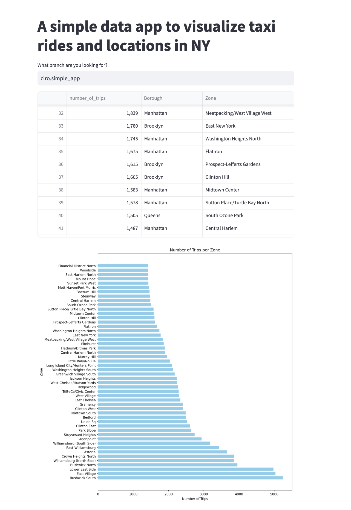

# Data visualization app with Streamlit

In this example, we will use the [TLC NY Taxi dataset](https://www.nyc.gov/site/tlc/about/tlc-trip-record-data.page) and build a pipeline that produces a table showcasing the boroughs and zones in New York City with the highest number of taxi pickups. 
Finally, we’ll use Streamlit to visualize this table in an interactive app.

👉👉👉 For more details, check out [our documentation](https://docs.bauplanlabs.com/en/latest/examples/data_app.html).

