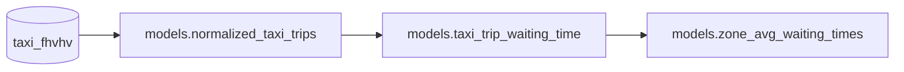

# Data Quality and Expectations

[Open in Github](https://github.com/BauplanLabs/examples/tree/main/04-data-quality-expectations)

In this example, we illustrate how to use expectation tests. These tests are statistical and quality checks applied to Bauplan models to ensure that the structure and values of the data meet our expectations. Expectation tests help detect data quality issues early and can be incorporated seamlessly into various workflows.

We can validate the output of our models by adding expectations as steps in a data pipeline, allowing us to catch quality issues before artifacts or pipelines are deployed to production. A key use case is ensuring the validity of data at ingestion—when the system receives data from external sources, such as other teams or vendors.

Expectations also capture domain-specific knowledge about the data. When well-documented, they contribute to comprehensive data documentation and promote the adoption of best practices, such as data contracts.

From a technical perspective, expectations are functions that take a tabular artifact (like a table or dataframe) as input and return a boolean value:

- True if the data meets the expectation and the test passes.
- False if the data fails to meet the expectation, indicating a compliance issue.

This approach ensures data quality throughout the pipeline and improves reliability by enforcing standards and facilitating smoother collaboration.

Because bauplan leverages vectorized [Single-Instruction-Multiple Data -SIMD-](https://en.wikipedia.org/wiki/Single_instruction,_multiple_data) operations, they allow to process quite large tables extraordinarily fast.

## Preliminary steps

👉👉👉 To use Bauplan, you need an API key for our preview environment: you can request one [here](https://www.bauplanlabs.com/#join).

If you want to get familiar with Bauplan, start with our [tutorial](https://docs.bauplanlabs.com/en/latest/tutorial/01_quick_start.html#)

## The pipeline

Make sure you have `bauplan_project.yml` file with a unique `project id` and a `project name`.

```yaml
project:
    id: bde138c0-0c48-4f37-a2be-cc55c8e8504a
    name: data-quality-expectations
```

In this example we will run a pipeline that computes the average waiting times for a yellow taxi for all the neighborhood in NYC. As usual, all function are fully containerized, so we can use different libraries to compute each step, like [PyArrow](https://arrow.apache.org/docs/python/index.html) for the first two models and [DuckDB](https://duckdb.org/docs/) for last one. These are arbitrary implementation choices, feel free to refactor the pipeline as you wish. The pipeline looks like this:

- The model `normalized_taxi_trips` gets some raw data from the table `taxi_fhvhv` in the data catalog and does some cleaning where needed.
- The model `taxi_trip_waiting_time` calculates the time between calling a cab and its arrival for each row.
- The model `zone_avg_waiting_times` computes the average waiting times aggregated by pickup zones.



## The expectation test

The file `expectations.py` in the project folder contains an expectation test from `bauplan.standard_expectations`. bauplan's library comes with a number of standard tests to cover the most common use cases (e.g. expect a column mean to be grater/smaller than, expect some/no/all nulls, expect all/no unique values, etc). Of course, you don't have to use our expectations. You can write you own or use other libraries like [Great Expectations](https://github.com/great-expectations/great_expectations). For a more detailed description of bauplan expectation library, please refer to the our documentation.

To calculate the waiting times for each trip, it's crucial that the `on_scene_datetime` column has no null values. So we write a simple python function that runs the `expect_column_no_nulls` test on the `normalized_taxi_trips` model, and returns `True` if passed and `False` if failed. Note that we need a special decorator `@bauplan.expectation`.

```python
import bauplan
# import the standard expectations from the library to use them in the functions below
from bauplan.standard_expectations import expect_column_no_nulls

@bauplan.expectation()
@bauplan.python('3.11')
def test_null_values_on_scene_datetime(
        data=bauplan.Model(
            # as input, we declare the bauplan model that we want to check
            'normalized_taxi_trips',
            columns=['on_scene_datetime'],
        )
):
    """

    As we are calculating the difference between request_datetime and on_scene_datetime
    we want toe make sure that on_scene_datetime has no null values.

    """

    # just return the result of the standard expectation (True if passed), passing to it
    # the input data, the column name to check, and the reference value
    _is_expectation_correct = expect_column_no_nulls(data, 'on_scene_datetime')

    # assert the result of the test. In this way, the pipeline will stop running if the expectation tests fails
    # in this way we can prevent data quality issues to become part of our production environment set up alerts.
    assert _is_expectation_correct, "expectation test failed: we expected on_scene_datetime to have no null values"

    # print the result of the test. In this way, the pipeline will not stop even if the expectation tests fails
    # in case of failure we are simply printing out the result of the test
    # if _is_expectation_correct:
    #     print('expectation test passed with flying colors')
    # else:
    #     print('expectation test failed!')

    return _is_expectation_correct  # return a boolean
```

As you can see, the expectation test in this example will stop the pipeline if it fails by asserting the test result with `_is_expectation_correct`. However, this isn't always necessary. We can change the behavior by removing the assert and printing the test result instead (see the commented code in the function). This flexibility allows us to decide what to do depending on the severity of data quality issues. Minor issues might not need to stop the workflow, while critical ones should halt the pipeline to prevent catastrophic data quality problems. Depending on the use case, we can program different workflows.

## Try it yourself

In this example, we will make things a bit more interactive. Let us run the pipeline as is and see what happens:

```bash
bauplan branch create <YOUR_USERNAME>.expectations
bauplan checkout <YOUR_USERNAME>.expectations
bauplan run
```

Oh, shoot! Something is wrong with out data: clearly there are null values in the column `on_scene_datetime`.

```bash
expectation.exp.test_null_values_on_scene_datetime @ expectations.py:22 |  ===> We are now checking for null values in on_scene_datetime
expectation.exp.test_null_values_on_scene_datetime @ expectations.py:22 |  ---> Exception occurred: AssertionError(expectation test failed: we expected on_scene_datetime to have no null values)
expectation.exp.test_null_values_on_scene_datetime @ expectations.py:22 |  ---> Stack trace
expectation.exp.test_null_values_on_scene_datetime @ expectations.py:22 |  --->
expectation.exp.test_null_values_on_scene_datetime @ expectations.py:22 |  ---> File '/bpln/bbff4e04/76a82274/snapshot/expectations.py', line 45, in test_null_values_on_scene_datetime
expectation.exp.test_null_values_on_scene_datetime @ expectations.py:22 |  --->     assert _is_expectation_correct, "expectation test failed: we expected on_scene_datetime to have no null values"
expectation.exp.test_null_values_on_scene_datetime @ expectations.py:22 |
2024-06-03 11:11:59 ERR Task failed
2024-06-03 11:12:00 ERR runtime task (exp[3.11].test_null_values_on_scene_datetime @ expectations.py:22) failed due to: AssertionError: expectation test failed: we expected on_scene_datetime to have no null values jobID=ee6c19c3-dc27-4b19-a8c9-53be47a84cbb
```

What do we do now? Well, we can go in the pipeline code and make sure to exclude the rows causing the problem. To do that, simply open `models.py`, go into the function `normalized_taxi_trips` and de-comment this line:

```bash
pickup_location_table = pc.drop_null(pickup_location_table)
```

This line will drop all the rows where there are null values, which should solve our problem. To make sure that it works, run the pipeline again. Does it works? Hurray!

👏👏Congratulations: you just used your first bauplan expectation test.👏👏

## Summary

With this example we have demonstrated how:

- to use bauplan to create and run expectation tests to ensure data quality in a data pipeline. By leveraging bauplan's standard expectations library, we validated that the `on_scene_datetime` column contains no null values, which is crucial for accurate waiting time calculations.
- expectation tests can halt the pipeline when critical data quality issues are detected, allowing developers to address problems before they impact production. This example highlights bauplan's ability to integrate robust data quality checks seamlessly into data workflows, ensuring reliable and accurate data processing.
