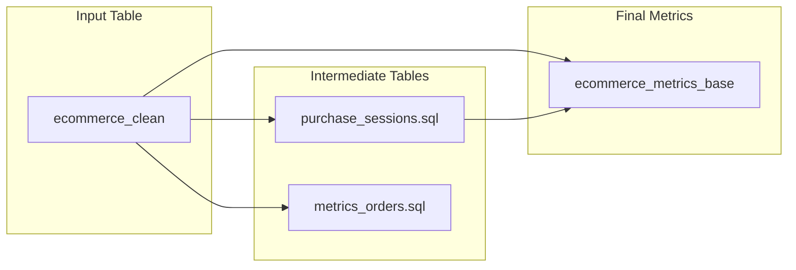

# Near Real-time Analytics Pipeline with bauplan

A demo implementing near real-time analytics for e-commerce data using bauplan, [Prefect](https://www.prefect.io/), and [Streamlit](https://streamlit.io/).

## Overview

This example shows how to:
1. Create analytics tables in Bauplan using the "public.ecommerce" dataset (from [Kaggle's E-commerce Behavior Data](https://www.kaggle.com/datasets/mkechinov/ecommerce-behavior-data-from-multi-category-store/data))
2. Simulate streaming data by appending rows to core tables and rebuilding downstream tables using Prefect for orchestration
3. Implement data branching strategies based on the [Write-Audit-Publish pattern](https://github.com/BauplanLabs/wap_with_bauplan_and_prefect/tree/main) to isolate ingestion from pipeline artifacts
4. Visualize live results through a Streamlit dashboard reflecting the latest data from the main branch

The project demonstrates near real-time processing, SQL/Python transformations, branch-based development, and live metric visualization.

## Prerequisites

### bauplan API key

👉👉👉 To use Bauplan, you need an API key for our preview environment: you can request one [here](https://www.bauplanlabs.com/#join). To get familiar with the API, start with our [tutorial](https://docs.bauplanlabs.com/en/latest/tutorial/01_quick_start.html#)

### AWS Setup
To simulate a continuous stream of incoming data, we use an S3 bucket. You'll need AWS credentials with permissions to:
- Create and manage S3 buckets
- Upload files
- List bucket contents


## Quick Start (Three Terminal Setup)

### Terminal 1: Environment

Create and activate virtual environment

```bash
python -m venv venv
source venv/bin/activate
pip install -r requirements.txt
```

### Terminal 2: Prefect Server
```bash
prefect server start
```

Keep this terminal running - it hosts the Prefect server that manages the scheduled tasks.


### Terminal 1: Prefect Setup and Run Pipeline


Configure Prefect (required before first run)
```bash
prefect config set PREFECT_API_URL=http://127.0.0.1:4200/api
```

Set up AWS credentials in one of two ways:

1. Environment variables:
```bash
export AWS_ACCESS_KEY_ID='your_key'
export AWS_SECRET_ACCESS_KEY='your_secret'
export AWS_DEFAULT_REGION='your-region'  # e.g., us-east-1
```

2. AWS config file (recommended):
Follow the [AWS CLI configuration guide](https://docs.aws.amazon.com/cli/v1/userguide/cli-configure-files.html)

After setting up AWS credentials, run:

```bash
cd orchestrator
python run.py --username your_bauplan_username \
              --namespace your_namespace \
              --dev_branch your_branch \
              --bucket_name your_bucket_name
```

### Terminal 3: Streamlit Dashboard
```bash
cd dashboard
streamlit run app.py
```
Keep this terminal running to maintain the dashboard server.

## Project Structure

```
.
├── orchestrator/
│   ├── run.py        # Main pipeline script
│   └── utils.py      # One-off setup operations
├── pipeline_analytics/
│   ├── models.py     # Core metrics computation
│   └── *.sql        # SQL transformations
└── dashboard/
    └── app.py        # Streamlit visualization
```

## What Happens When You Run the Script

### First Run: ONE-OFF Setup (utils.py)
1. Creates development branch from main
2. Builds initial cleaned dataset
3. Sets up S3 bucket for simulated events

### Every 5 Minutes: Scheduled Operations (run.py)
1. Simulates new e-commerce events
2. Ingests data using temporary branches
3. Updates analytics tables

## Analytics pipeline (pipeline_analytics forlder)
This creates a full funnel of metrics from browsing (views) to purchasing (revenue), enabling analysis of:
- User engagement (sessions)
- Conversion (purchases)
- Revenue performance
- Brand-level trends
- Hourly patterns

Here's an explanation of the analytics pipeline files:



## Data Viz
The project includes a simple Streamlit dashboard  `dashboard/app.py` to visualize the final aggregated metrics from our analytics pipeline.
The dashboard provides an easy way to monitor the calculated metrics with minimal setup.

### Usage
The visualization is straightforward:
1. Select your Bauplan username from the dropdown
2. Choose the branch created by the analytics pipeline
3. View your metrics instantly

For more advanced Streamlit features and customization options, check out the [Streamlit documentation](https://docs.streamlit.io/).

## Monitoring
- Check Prefect UI at http://localhost:4200 for pipeline runs
- View dashboard at http://localhost:8501
