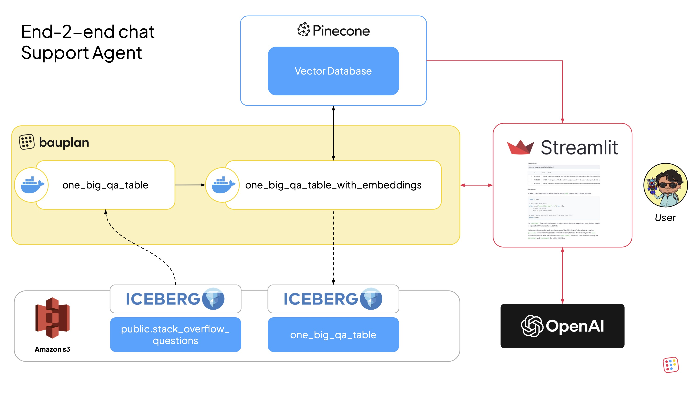
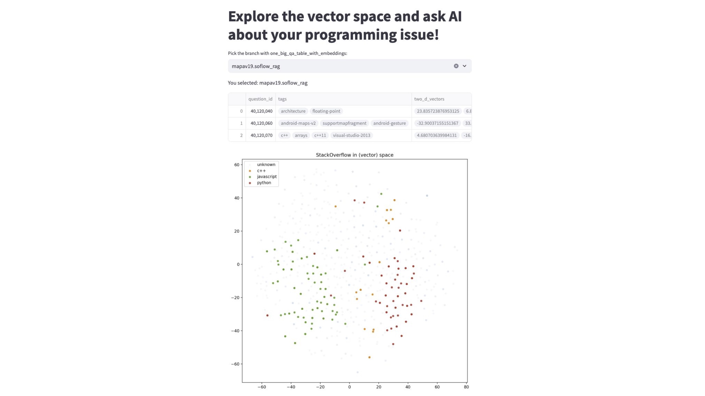
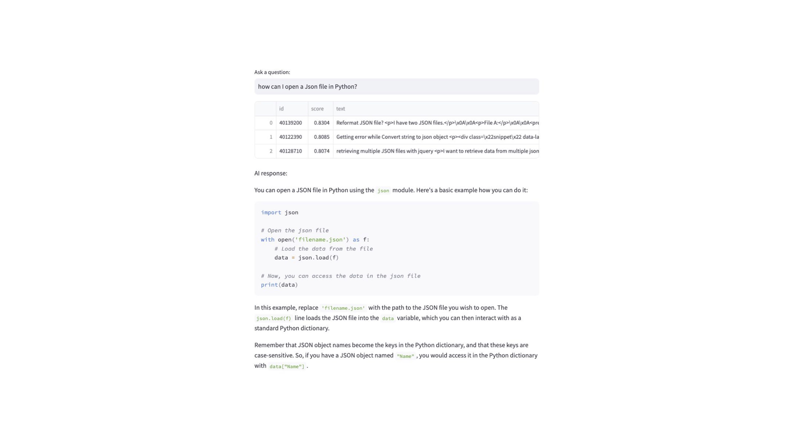

# RAG with bauplan and pinecone

## Overview
This is a reference implementation of an end-to-end Retrieval-Augmented Generation (RAG) pipeline using bauplan for data preparation and Pinecone for vector storage and retrieval.

## Use Case
We build a conversational support agent capable of answering technical questions using a dataset of StackOverflow Q&A. The pipeline:
* Uses bauplan for data ingestion, joining, transformation, and exploration.
* Generates text embeddings via Pinecone’s API and stores them in a vector database.
* Includes a [Streamlit](https://streamlit.io/) app to explore the embedding space and interact with a natural language Q&A interface powered by Pinecone and OpenAI.

Q&A data is sourced from the [Kaggle StackSample Dataset](https://www.kaggle.com/datasets/stackoverflow/stacksample), available in the [bauplan sandbox](https://www.bauplanlabs.com/#join).

## Architecture & Data Flow
* **Data source:** The StackOverflow dataset (questions, answers, tags) is available as Iceberg tables in the `public` namespace of bauplan.
* **Pipeline:** Defined in `src/bpln_pipeline`, the pipeline processes, embeds, and stores the data in both Pinecone and S3 as an Iceberg table.
* **Data App:** The Streamlit app in src/app retrieves data for exploration and serves as a UI for live Q&A using Pinecone and an LLM (e.g., OpenAI).


## Setup
### Python Environment
Ensure Python 3.10+ is installed, and use a virtual environment:

```bash
python3 -m venv venv
source venv/bin/activate
pip install -r requirements.txt
```

### Bauplan
* [Join Bauplan](https://www.bauplanlabs.com/#join) and create your username + API key.
* Complete [the 3-minute tutorial](https://docs.bauplanlabs.com/en/latest/tutorial/index.html).

Several public datasets will be accessible in the sandbox, including the one used here.

### Pinecone
* Create a cluster on [Pinecone](https://docs.pinecone.io/guides/get-started/quickstart).
* Obtain your API key from the Pinecone dashboard.

### OpenAI
* Get an [OpenAI](https://platform.openai.com/api-keys) api key to call their APIs.

## Running the Project
### Explore the Dataset
You can use the CLI to inspect table schemas in the data catalog:

```bash
bauplan table get public.stack_overflow_questions
bauplan table get public.stack_overflow_answers
bauplan table get public.stack_overflow_tags
```

To explore the data, you can use Bauplan query engine directly in the CLI. 
For example, let us run a query to explore tag distribution:

```bash
bauplan query "SELECT tag, COUNT(*) AS _C FROM public.stack_overflow_tags GROUP BY 1 ORDER BY _C DESC"
```

### Run the Data Pipeline
First of all, create a [data branch](https://docs.bauplanlabs.com/en/latest/tutorial/02_catalog.html) and checkout to it - remember that you will need your username for this:

```bash
cd src/bpln_pipeline
bauplan branch create <YOUR_USER_NAME>.soflow_rag
bauplan branch checkout <YOUR_USER_NAME>.soflow_rag
```

Add your Pinecone and your OpenAI keys securely (never commit them):

```bash
bauplan parameter set --name pinecone_key --value <YOUR_PINECONE_KEY> --type secret
bauplan parameter set --name openai_key --value <YOUR_OPENAI_KEY> --type 
```

Verify the parameter in `bauplan_project.yml` in the folder `src/bpln_pipeline`. Then run the pipeline:
```bash
cd src/bpln_pipeline
bauplan run
```

The run will write a new table called `one_big_qa_table_with_embeddings` in your active data branch. 
To check the resulting table run:
```bash
bauplan table get one_big_qa_table_with_embeddings
```
Run a query to see the data inside the table:
```bash
bauplan query "SELECT question_id, COUNT(*) as _C FROM one_big_qa_table GROUP BY question_id ORDER BY _C DESC LIMIT 10"
```
Example query:

## Run the Streamlit App
To run the Streamlit app you will simply have to run this command and provide your username:

```bash
cd src/app
streamlit run explore_and_answer.py -- --bauplan_username <YOUR_USERNAME>
```

The app assumes you have run the pipeline in a branch: once the app is running, select the right branch to query the data to get started.
Note that the command `streamlit run` parses parameters slightly differently, so you need to use the `--` separator to pass arguments to the script (`streamlit run explore_and_recommend.py -- --bauplan_username foo`)
The app will open in your browser for embedding exploration and question answering.




## License

The code in this repository is released under the MIT License and provided as is.