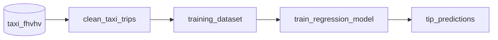

# A machine learning pipeline

In this example we show how to organize and run a simple machine learning project with bauplan. We will build and run a pipeline that takes some raw data from the [TLC NY taxi dataset](taxi), transforms it into a training dataset with the right features, trains a Linear Regression model to predict **the tip amount** of taxi rides, and writes the predictions to an Iceberg table. We will also use the Bauplan SDK in some notebooks to explore the dataset and the predictions.

## Preliminary steps

👉👉👉 To use Bauplan, you need an API key for our preview environment: you can request one [here](https://www.bauplanlabs.com/#join).

If you want to get familiar with Bauplan, start with our [tutorial](https://docs.bauplanlabs.com/en/latest/tutorial/01_quick_start.html#)


## Set up

We will use some [Jupyter Notebooks](https://jupyter.org/) in this example, so we need to install the right dependencies to run them. Go into `ml-workflow`, and create a proper virtual environment.

```bash
cd ml-workflow
python -m venv venv
source venv/bin/activate
pip install -r requirements.txt
```

## The pipeline

In the folder you can find a file called `models.py` with the pipeline of this example. This pipeline will train a Linear Regression model that predicts the **tip amount** of taxi rides.



## Exploratory analysis

The first thing we are going to do is to use one of our notebooks to explore the dataset and understand what are the best features to train our model. This is a fairly simple thing to do, thanks to our SDK. Start Jupyter Lab and then open the notebook `feature_exploration.ipynb` (check directly the code in there is commented).

```bash
cd notebooks
../venv/bin/jupyter lab
```

In the notebook, we get a sample of data from `taxi_fhvhv` and compute a correlation matrix to print a heat map that will tell us which features have the strongest correlation with our target variable `tips`. The top features are `base_passnger_fare`, `trip_miles` and `trip_time`, so we are going to use these columns to train the Linear Regression model.


## Prepare the training dataset

The first function of our pipeline gets us the [data set](https://docs.bauplanlabs.com/en/latest/datasets.html#taxi-fhvhv) we are going to work with. Using our Python S3 scan, the function `clean_taxi_trips` retrieves 10 columns from the table `taxi_fhvhv`, filtering for `pickup_datetime`. This will give us 6 months of data for a total of approximately 19GB. This should also give you a good idea of how performant the system is when you work on reasonably large data samples.

```python
import bauplan

@bauplan.model(materialize=False)
@bauplan.python('3.11', pip={'pandas': '2.2.0'})
def clean_taxi_trips(
        data=bauplan.Model(
            'taxi_fhvhv',
            # this function performs an S3 scan directly in Python, so we can specify the columns and the filter pushdown
            # by pushing the filters down to S3 we make the system considerably more performant
            columns=[
                'pickup_datetime',
                'dropoff_datetime',
                'PULocationID',
                'DOLocationID',
                'trip_miles',
                'trip_time',
                'base_passenger_fare',
                'tolls',
                'sales_tax',
                'tips'],
            filter="pickup_datetime >= '2022-06-01T00:00:00-05:00' AND pickup_datetime < '2023-11-30T00:00:00-05:00'"
        )
):
    import math
    import pandas as pd
    import numpy as np

    # debugging lines to check print the version of Python interpreter and the size of the table
    size_in_gb = data.nbytes / math.pow(1024, 3)
    print(f"This table is {size_in_gb} GB and has {data.num_rows} rows")

    # input data is always an Arrow table, so if you wish to use pandas, you need an explicit conversion
    df = data.to_pandas()
    # exclude rows based on multiple conditions
    df = df[(df['trip_miles'] > 1.0) & (df['tips'] > 0.0) & (df['base_passenger_fare'] > 1.0)]

    # output the data as a Pandas dataframe
    return df
```

For the second function, we only care about a subset of the data retrieved, so we will explicitly declare in the definition of the input model the columns that we want. The function uses then Pandas and Scikit-Learn to prepare a normalized dataset that we can use as a training set for the ML model. In particular, we take care of log-normalizing the distribution of one of our training features `trip_miles` and to rescale all features to make sure that we don't accidentally rely on different scales.

```python
@bauplan.model(materialize=False)
# for this function we specify two dependencies, Pandas 2.2.0 and Scikit-Learn 1.3.2
@bauplan.python('3.11', pip={'pandas': '2.2.0', 'scikit-learn': '1.3.2'})
def training_dataset(
        data=bauplan.Model(
            'clean_taxi_trips',
        )
):
    import pandas as pd
    import numpy as np
    from sklearn.preprocessing import StandardScaler

    # convert data from Arrow to Pandas
    df = data.to_pandas()

    # drop all the rows with NaN values
    df = df.dropna()
    # add a new column with log transformed trip_miles to deal with skewed distributions
    df['log_trip_miles'] = np.log10(df['trip_miles'])
    # define training and target features
    features = df[['log_trip_miles', 'base_passenger_fare', 'trip_time']]
    target = df['tips']
    pickup_dates = df['pickup_datetime']

    # scale the features to ensure that they have similar scales
    # compute the mean and standard deviation for each feature in the training set
    # then use the computed mean and standard deviation to scale the features.
    scaler = StandardScaler()
    scaled_features = scaler.fit_transform(features)
    scaled_df = pd.DataFrame(scaled_features, columns=features.columns)
    scaled_df['tips'] = target.values # Add the target column back to the DataFrame
    scaled_df['pickup_datetime'] = pickup_dates.values  # Add the date column back to the DataFrame

    # print the size of the training dataset
    print(f"The training dataset has {len(scaled_df)} rows")

    # The result is a new table where each feature will have a mean of 0 and a standard deviation of 1
    return scaled_df
```

## Train the model

Like any other pipeline step, we can train a model by running arbitrary code in a Bauplan model. The model `train_linear_regression` uses Scikit-Learn to prepare a test, validation and test set and set the training features apart from the target feature. Once the dataset has been split into three, we can simply train the model using Sciki-Learn's built-in `LinearRegression` method.

## Passing models across functions

Models are functions from and to tabular artifacts, like tables and dataframes. The general form of a data pipeline is a sequence of functions that take a table-like object as a input and return a table-like object as an output.

As far as users are concerned, this is the only strong formal constraint over the shape of a pipeline, and as long as this structural requirement is respected, everything else is abstracted away by the system, providing considerable freedom and ease of use to the developer.

For instance, developers can implement Bauplan models as either Python function or SQL queries without worrying about the environments that run the single functions, or how the data are converted and passed across models. As long as models return table-like objects (e.g. Arrow Table, a Pandas DataFrame, list of dictionaries, etc), the pipeline will run.

This design choice makes the abstractions we manipulate extremely simple: if it is not a table, it is a function that outputs a table.

In addition to tables, ML workflows deal also with models and as a consequence we need a way to pass models across functions. Bauplan provides a method to persist and retrieve models in a key, value store with the built-in utility `bauplan.store`.

In this way, it is possible to pass Machine Learning models across Bauplan functions.

```python
@bauplan.model(columns=['*'], materialize=False)
@bauplan.python('3.11', pip={'scikit-learn': '1.3.2'})
def train_model(data='my_table'):

    from sklearn.linear_model import LinearRegression
    reg = LinearRegression().fit(X_train, y_train)

    from bauplan.store import save_obj
    save_obj("regression", reg)

    return data


@bauplan.model(columns=['*'], materialize=False)
@bauplan.python('3.11', pip={'scikit-learn': '1.3.2'})
def run_model(data='train_model'):

    from bauplan.store import save_obj
    reg = load_obj("regression")

        from sklearn.linear_model import LinearRegression
    y_hat = reg.predict(data='train_model')

    prediction_table = data[['feature']
    prediction_table['predictions'] = y_hat

    return prediction_table
```

The entire code for training and testing a Linear Regression model is the following. It is heavily commented, so you can read through it to get a clear understanding of how it works.

This is not the only design pattern for Machine Learning. For instance, we could decide to serialize the model and save it as a file to retrieve it later on in the pipeline or even use a more sophisticated system like a feature store. Ultimately, the framework is powerful enough to allow for more complex designs. For now, it is enough to know that `bauplan.store` provides a simple way to pass a ML model across Bauplan functions in a DAG.

```python
@bauplan.model(materialize=False)
# for this function we specify two dependencies, Pandas 2.2.0 and Scikit-Learn 1.3.2
@bauplan.python('3.11', pip={'pandas': '2.2.0', 'scikit-learn': '1.3.2'})
def train_regression_model(
        data=bauplan.Model(
            'training_dataset',
        )
):
    from sklearn.model_selection import train_test_split
    from sklearn.linear_model import LinearRegression

    # convert arrow input into a Pandas DataFrame
    df = data.to_pandas()

    # Define the training and validation set sizes
    training_threshold = 0.8
    validation_threshold = 0.1  # This will implicitly define the test size as the remaining percentage
    # Split the dataset into training and remaining sets first
    train_set, remaining_set = train_test_split(df, train_size=training_threshold, random_state=42)
    # Split the remaining set into validation and test sets
    validation_threshold_adjusted = validation_threshold / (1 - training_threshold)
    validation_set, test_set = train_test_split(remaining_set, test_size=validation_threshold_adjusted, random_state=42)
    #print(f"The training dataset has {len(train_set)} rows")
    print(f"The validation set has {len(validation_set)} rows")
    print(f"The test set has {len(test_set)} rows (remaining)")

    # prepare the feature matrix (X) and target vector (y) for training
    X_train = train_set[['log_trip_miles', 'base_passenger_fare', 'trip_time']]
    y_train = train_set['tips']
    # Train the linear regression model
    reg = LinearRegression().fit(X_train, y_train)

    # persist the model in a key, value store so we can use it later in the DAG
    from bauplan.store import save_obj
    save_obj("regression", reg)

    # Prepare the feature matrix (X) and target vector (y) for validation
    X_test = validation_set[['log_trip_miles', 'base_passenger_fare', 'trip_time']]
    y_test = validation_set['tips']

    # Make predictions on the validation set
    y_hat = reg.predict(X_test)
    # Print the model's mean accuracy (R^2 score)
    print("Mean accuracy: {}".format(reg.score(X_test, y_test)))

    # Prepare the output table with predictions
    validation_df = validation_set[['log_trip_miles', 'base_passenger_fare', 'trip_time', 'tips']]
    validation_df['predictions'] = y_hat

    # Display the validation set with predictions
    print(validation_df.head())

    return test_set


@bauplan.model(materialize=True)
# for this function we specify two dependencies, Pandas 2.2.0 and Scikit-Learn 1.3.2
@bauplan.python('3.11', pip={'scikit-learn': '1.3.2', 'pandas': '2.1.0'})

def tip_predictions(
        data=bauplan.Model(
            'train_regression_model',
        )

):

    # retrieve the model trained in the previous step of the DAG from the key, value store
    from bauplan.store import load_obj
    reg = load_obj("regression")

    # convert the test set from an Arrow table to a Pandas DataFrame
    test_set = data.to_pandas()

    # Prepare the feature matrix (X) and target vector (y) for test
    X_test = test_set[['log_trip_miles', 'base_passenger_fare', 'trip_time']]
    y_test = test_set['tips']

    # Make predictions on the test set
    y_hat = reg.predict(X_test)
    # Print the model's mean accuracy (R^2 score)
    print("Mean accuracy: {}".format(reg.score(X_test, y_test)))

    # Prepare the finale output table with the predictions
    prediction_df = test_set[['log_trip_miles', 'base_passenger_fare', 'trip_time', 'tips']]
    prediction_df['predictions'] = y_hat

    # return the prediction dataset
    return prediction_df
```

## Explore the results

First of all, we create a branch and checkout in such branch.

```bash
bauplan branch create <YOUR_USERNAME>.<YOUR_BRANCH_NAME>
bauplan branch checkout <YOUR_USERNAME>.<YOUR_BRANCH_NAME>
```

We now run the pipeline to materialize our model's predictions as an Iceberg table in the data catalog.

```bash
cd pipeline
bauplan run
```

Finally, it is time to use the Bauplan SDK to integrate the table into exploration tools like notebooks or into visualization app.

To visualize how accurate our predictions are, we use a few different types of plots in the notebook using `matplotlib` and `seaborn`. As usual by using the SDK and Bauplan's method `query` to interact with the data directly in our branch of the data catalog.

Start Jupyter Lab once again, and open the notebook `prediction_visualization.ipynb`.

```bash
cd notebooks
../venv/bin/jupyter lab
```

We will have three different plots to help us understand how good is the linear regression model we just trained.

**Actual vs. Predicted Values Plot**: This scatter plot shows how well the predicted values match the actual values. Ideally, the points should lie on the line `y = x`.


**Residual Plot**: This plot shows the residuals (differences between actual and predicted values) against the predicted values. Ideally, the residuals should be randomly distributed around zero, indicating that the model captures the data's patterns.


**Distribution of Residuals**: This histogram shows the distribution of the residuals. Ideally, the residuals should be normally distributed around zero.


The code in there is heavily commented, so you can explore it directly in the notebook.

## Do you wanna know more?

Bauplan is the serverless lakehouse: you can load, transform, query data all from your code (CLI or Python). You can learn more [here](https://www.bauplanlabs.com/), read the [docs](https://docs.bauplanlabs.com/) or explore its [architecture](https://arxiv.org/pdf/2308.05368) and [ergonomics](https://arxiv.org/pdf/2404.13682).
